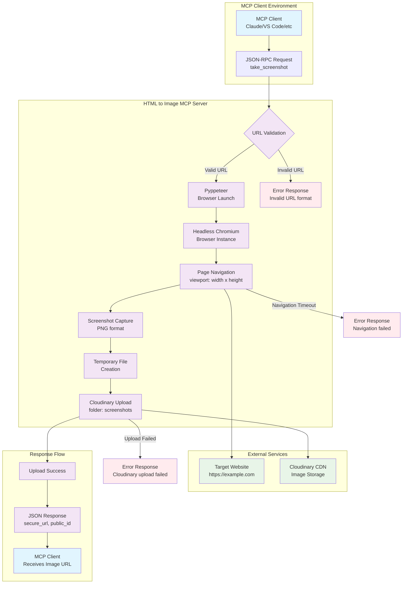

[](https://smithery.ai/server/@alperenkocyigit/html-to-image-mcp)
# HTML to Image MCP Server

A sophisticated Model Context Protocol (MCP) server that captures high-quality screenshots of web pages and automatically uploads them to Cloudinary for easy sharing and storage.

## 🌟 Features

- **📸 Web Page Screenshots**: Capture full-resolution screenshots of any publicly accessible webpage
- **☁️ Cloudinary Integration**: Automatic upload to Cloudinary with secure URLs
- **🎨 Customizable Dimensions**: Configure viewport width and height for perfect captures
- **📄 Full Page Support**: Option to capture entire page height beyond viewport
- **🚀 High Performance**: Built with async/await for optimal speed
- **🔒 Secure**: Environment-based configuration for API credentials
- **🐳 Docker Ready**: Containerized deployment support

## 🛠️ Installation

### Prerequisites

Before installing, make sure you have:
- Python 3.8 or higher
- A Cloudinary account ([Sign up for free](https://cloudinary.com/))
- Docker (optional, for containerized deployment)

### Quick Setup

1. **Clone the repository**:
```bash
git clone git@github.com:alperenkocyigit/html-to-image-mcp.git
cd html-to-image-mcp
```

2. **Install dependencies**:
```bash
pip install -r requirements.txt
```

3. **Download Chromium browser**:
```bash
python setup.py
```

4. **Configure environment variables**:
Create a `.env` file in the project root:
```env
CLOUDINARY_CLOUD_NAME=your_cloud_name
CLOUDINARY_API_KEY=your_api_key
CLOUDINARY_API_SECRET=your_api_secret
```

### Docker Installation

1. **Build the Docker image**:
```bash
docker build -t html-to-image-mcp .
```

2. **Run with environment variables**:
```bash
docker run -e CLOUDINARY_CLOUD_NAME=your_cloud_name \
           -e CLOUDINARY_API_KEY=your_api_key \
           -e CLOUDINARY_API_SECRET=your_api_secret \
           html-to-image-mcp
```

## 🚀 Usage

### Easy installation via Smithery
Visit smithery and follow instructions

https://smithery.ai/server/@alperenkocyigit/html-to-image-mcp

### Starting the MCP Server

#### For Local Development (STDIO mode)
```bash
MCP_TRANSPORT=stdio python server.py
```

The server will run on STDIO transport for local development and testing.

#### For HTTP Deployment (Streamable HTTP mode)
```bash
python server.py
```

The server will run on HTTP transport (streamable-http) on `http://0.0.0.0:8000`, suitable for container deployments and hosted environments like Smithery. The MCP endpoint is available at `/mcp`.

### Tool: `take_screenshot`

Captures a screenshot of a webpage and uploads it to Cloudinary.

#### Parameters

| Parameter | Type | Required | Default | Description |
|-----------|------|----------|---------|-------------|
| `url` | string | ✅ Yes | - | URL of the webpage to screenshot. Must start with `https://` or `http://` |
| `width` | integer | ❌ Optional | 1280 | Viewport width in pixels |
| `height` | integer | ❌ Optional | 720 | Viewport height in pixels |
| `fullPage` | boolean | ❌ Optional | false | Capture full page height instead of viewport only |

#### Example Usage

**Basic screenshot**:
```json
{
  "name": "take_screenshot",
  "arguments": {
    "url": "https://example.com"
  }
}
```

**Custom dimensions**:
```json
{
  "name": "take_screenshot",
  "arguments": {
    "url": "https://github.com",
    "width": 1920,
    "height": 1080
  }
}
```

**Full page capture**:
```json
{
  "name": "take_screenshot",
  "arguments": {
    "url": "https://news.ycombinator.com",
    "width": 1280,
    "height": 720,
    "fullPage": true
  }
}
```

#### Response Format

```json
{
  "status": 200,
  "message": "Screenshot captured and uploaded successfully",
  "url": "https://res.cloudinary.com/your-cloud/image/upload/v1234567890/screenshots/abc123.png",
  "public_id": "screenshots/abc123",
  "dimensions": {
    "width": 1280,
    "height": 720,
    "fullPage": false
  }
}
```

## ⚙️ Configuration

### Environment Variables

| Variable | Description | Required |
|----------|-------------|----------|
| `CLOUDINARY_CLOUD_NAME` | Your Cloudinary cloud name | ✅ |
| `CLOUDINARY_API_KEY` | Your Cloudinary API key | ✅ |
| `CLOUDINARY_API_SECRET` | Your Cloudinary API secret | ✅ |

### Cloudinary Setup

1. **Create a Cloudinary account** at [cloudinary.com](https://cloudinary.com/)
2. **Get your credentials** from the Dashboard:
   - Cloud Name
   - API Key  
   - API Secret
3. **Add credentials** to your `.env` file or environment variables

## 🏗️ Architecture



### Key Components

- **MCP Server**: Handles protocol communication and request routing
- **Pyppeteer**: Controls headless Chromium for screenshot capture
- **Cloudinary SDK**: Manages image upload and storage
- **Docker**: Provides consistent deployment environment

## 🔧 Development

### Project Structure

```
html-to-image-mcp/
├── server.py          # Main MCP server implementation
├── app.py             # Utility functions for screenshot capture
├── setup.py           # Chromium download and setup
├── requirements.txt   # Python dependencies
├── Dockerfile         # Container configuration
├── smithery.yaml      # Smithery deployment config
└── README.md          # This documentation
```

### Running Tests

```bash
# Test Chromium installation
python setup.py

# Test screenshot functionality
python -c "
import asyncio
from app import url_to_cloudinary_url_async
print(asyncio.run(url_to_cloudinary_url_async('https://example.com')))
"
```

### Adding Features

1. **Fork the repository**
2. **Create a feature branch**: `git checkout -b feature-name`
3. **Make your changes**
4. **Test thoroughly**
5. **Submit a pull request**

## 🐳 Docker Deployment

### Building

```bash
docker build -t html-to-image-mcp .
```

### Running

```bash
docker run -d \
  --name html-to-image \
  -p 8000:8000 \
  -e CLOUDINARY_CLOUD_NAME=your_cloud_name \
  -e CLOUDINARY_API_KEY=your_api_key \
  -e CLOUDINARY_API_SECRET=your_api_secret \
  html-to-image-mcp
```

The server will be accessible at `http://localhost:8000` for HTTP/SSE transport.

### Docker Compose

```yaml
version: '3.8'
services:
  html-to-image-mcp:
    build: .
    ports:
      - "8000:8000"
    environment:
      - CLOUDINARY_CLOUD_NAME=your_cloud_name
      - CLOUDINARY_API_KEY=your_api_key
      - CLOUDINARY_API_SECRET=your_api_secret
    restart: unless-stopped
```

## 🚨 Troubleshooting

### Common Issues

**"Chromium download failed"**
```bash
# Install required system dependencies (Ubuntu/Debian)
sudo apt-get update
sudo apt-get install -y \
  gconf-service libasound2 libatk1.0-0 libc6 libcairo2 libcups2 \
  libdbus-1-3 libexpat1 libfontconfig1 libgcc1 libgconf-2-4 \
  libgdk-pixbuf2.0-0 libglib2.0-0 libgtk-3-0 libnspr4 \
  libpango-1.0-0 libpangocairo-1.0-0 libstdc++6 libx11-6 \
  libx11-xcb1 libxcb1 libxcomposite1 libxcursor1 libxdamage1 \
  libxext6 libxfixes3 libxi6 libxrandr2 libxrender1 libxss1 \
  libxtst6 ca-certificates fonts-liberation libappindicator1 \
  libnss3 lsb-release xdg-utils wget
```

**"Invalid URL format"**
- Ensure URLs start with `https://` or `http://`
- Check that the website is publicly accessible
- Verify there are no typos in the URL

**"Cloudinary upload failed"**
- Verify your Cloudinary credentials are correct
- Check your Cloudinary account limits
- Ensure your API key has upload permissions

**"Navigation timeout"**
- Increase timeout in server configuration
- Check if the target website is responsive
- Verify your internet connection

### Performance Tips

- Use smaller viewport sizes for faster captures
- Enable `fullPage: false` for better performance
- Consider caching frequently accessed screenshots
- Monitor Cloudinary usage limits

## 📚 API Reference

### URL Validation

The server validates URLs to ensure they:
- Start with `https://` or `http://`
- Have a valid domain structure
- Are properly formatted according to RFC standards

### Screenshot Options

- **Viewport Size**: Controls the browser window size
- **Full Page**: Captures content beyond the initial viewport
- **PNG Format**: Always outputs high-quality PNG images
- **Network Idle**: Waits for network requests to complete

### Error Handling

The server provides detailed error messages for:
- Invalid or missing URLs
- Network connectivity issues
- Cloudinary upload failures
- Browser automation problems

## 📝 License

This project is licensed under the MIT License - see the LICENSE file for details.

## 🤝 Contributing

Contributions are welcome! Please feel free to submit a Pull Request. For major changes, please open an issue first to discuss what you would like to change.

## 📞 Support

- **Issues**: Report bugs on GitHub Issues
- **Documentation**: Check this README for comprehensive guides
- **Community**: Join discussions in GitHub Discussions

---

**Made by Alperen Koçyiğit with ❤️ for the MCP community**
